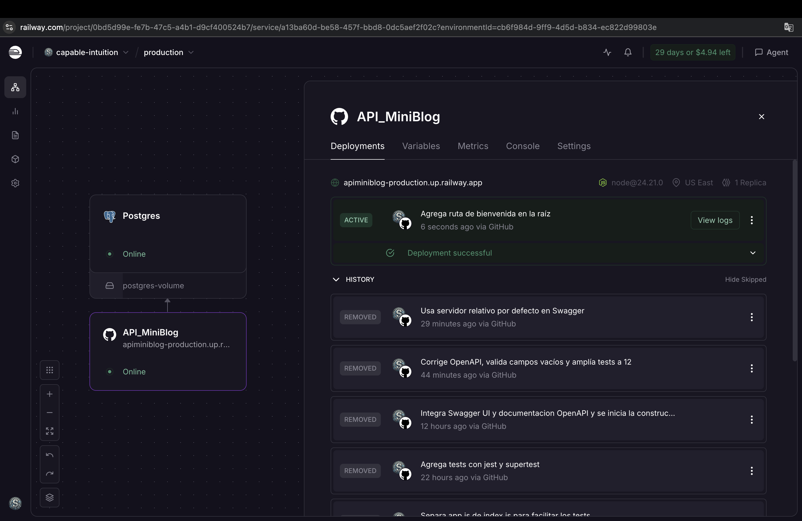
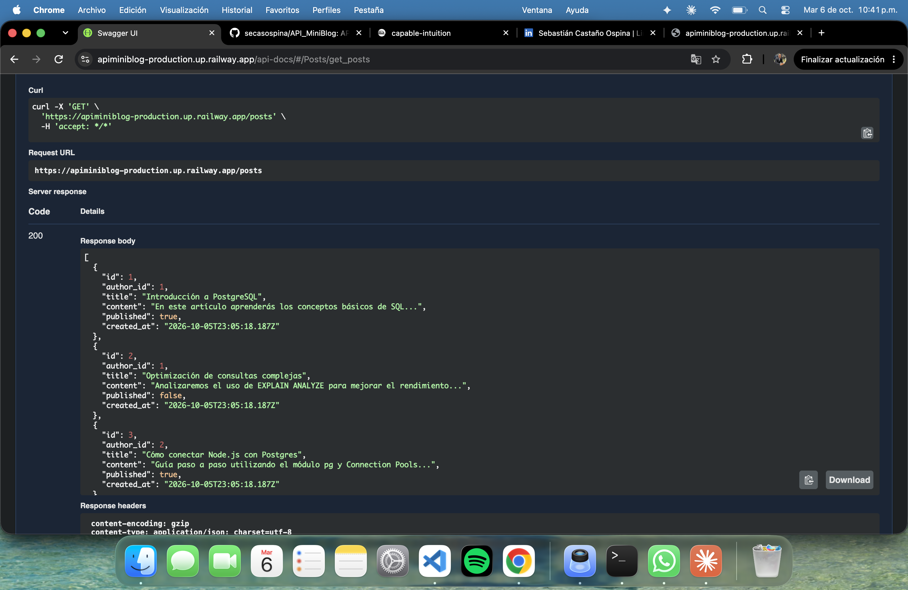

# MiniBlog API

API REST para gestionar **autores** y **posts** de un mini blog. Desarrollada con Node.js, Express y PostgreSQL (driver `pg`, sin ORM), documentada con OpenAPI 3.0 / Swagger UI y desplegada en Railway.

---

## Enlaces del proyecto

- **API en producción (Railway):** https://apiminiblog-production.up.railway.app
- **Documentación interactiva (Swagger UI):** https://apiminiblog-production.up.railway.app/api-docs
- **Repositorio:** https://github.com/secasospina/API_MiniBlog

Evidencia del despliegue:




---

## Tecnologías

- **Node.js** y **Express 5**
- **PostgreSQL** con el driver `pg` (Pool de conexiones, consultas parametrizadas)
- **dotenv** para variables de entorno
- **Jest** y **Supertest** para los tests
- **OpenAPI 3.0** y **swagger-ui-express** para la documentación
- **Railway** para el despliegue de la API y la base de datos

---

## Estructura del proyecto

```
index.js                      Arranca el servidor (listen)
app.js                        Crea y exporta la app (rutas, middlewares, Swagger)
database.js                   Pool de pg (usa DATABASE_URL si existe; si no, DB_*)
routes/authors.js             Rutas de autores
routes/posts.js               Rutas de posts
services/authors.js           Consultas SQL de autores
services/posts.js             Consultas SQL de posts
middlewares/validateId.js     Valida ids (entero positivo)
middlewares/errorHandler.js   404 para rutas inexistentes y manejo global de errores
sql/schema.sql                Creación de tablas e índice
sql/seed.sql                  Datos de ejemplo (3 autores y 4 posts)
test/api.test.js              Tests con Jest + Supertest
openapi.yaml                  Especificación OpenAPI
.env.example                  Plantilla de variables de entorno
```

---

## Modelo de datos

**authors**

| Columna    | Tipo         | Restricciones             |
| ---------- | ------------ | ------------------------- |
| id         | SERIAL       | PRIMARY KEY               |
| name       | VARCHAR(100) | NOT NULL                  |
| email      | VARCHAR(150) | UNIQUE, NOT NULL          |
| bio        | TEXT         |                           |
| created_at | TIMESTAMP    | DEFAULT CURRENT_TIMESTAMP |

**posts**

| Columna    | Tipo         | Restricciones                                         |
| ---------- | ------------ | ----------------------------------------------------- |
| id         | SERIAL       | PRIMARY KEY                                           |
| author_id  | INT          | NOT NULL, FOREIGN KEY → authors(id) ON DELETE CASCADE |
| title      | VARCHAR(255) | NOT NULL                                              |
| content    | TEXT         | NOT NULL                                              |
| published  | BOOLEAN      | DEFAULT FALSE                                         |
| created_at | TIMESTAMP    | DEFAULT CURRENT_TIMESTAMP                             |

Índice: `idx_posts_author_id` sobre `posts(author_id)`.

> Nota: el enunciado menciona `FK -> users.id`; en este proyecto la tabla de usuarios se llama `authors`, por lo que la clave foránea apunta a `authors.id`.

---

## Ejecución en local

### Requisitos

- Node.js 18 o superior (desarrollado con v24) y npm
- PostgreSQL instalado y en ejecución (desarrollado con la versión 18)

### Pasos

1. **Clonar el repositorio e instalar dependencias:**

   ```bash
   git clone https://github.com/secasospina/API_MiniBlog.git
   cd API_MiniBlog
   npm install
   ```

2. **Crear la base de datos:**

   ```bash
   psql -U postgres -c "CREATE DATABASE miniblog;"
   ```

3. **Crear las tablas y cargar los datos de ejemplo:**

   ```bash
   psql -U postgres -d miniblog -f sql/schema.sql
   psql -U postgres -d miniblog -f sql/seed.sql
   ```

   `schema.sql` empieza con `DROP TABLE IF EXISTS`, así que se puede volver a ejecutar para reiniciar la base. Ejecuta `seed.sql` una sola vez después de cada `schema.sql`; si lo ejecutas dos veces se duplican los posts.

4. **Configurar las variables de entorno:** copia la plantilla y complétala con tus datos.

   ```bash
   cp .env.example .env
   ```

   Contenido del archivo `.env`:

   ```
   PORT=3000
   DB_HOST=localhost
   DB_PORT=5432
   DB_USER=postgres
   DB_PASSWORD=tu_password
   DB_NAME=miniblog
   ```

   El archivo `.env` no se sube al repositorio (está en `.gitignore`).

5. **Iniciar el servidor:**

   ```bash
   npm run dev
   ```

   - API: http://localhost:3000
   - Documentación: http://localhost:3000/api-docs

   Para ejecutar sin modo watch: `npm start`.

---

## Endpoints

| Método y ruta                 | Descripción                                                                                      | Respuestas                  |
| ----------------------------- | ------------------------------------------------------------------------------------------------ | --------------------------- |
| `GET /authors`                | Lista los autores                                                                                | 200                         |
| `GET /authors/:id`            | Detalle de un autor                                                                              | 200, 400, 404               |
| `POST /authors`               | Crea un autor (`name` y `email` obligatorios)                                                    | 201, 400                    |
| `PUT /authors/:id`            | Actualiza un autor (`name` y `email` obligatorios)                                               | 200, 400, 404               |
| `DELETE /authors/:id`         | Elimina un autor y sus posts (CASCADE)                                                           | 204, 400, 404               |
| `GET /posts`                  | Lista los posts                                                                                  | 200                         |
| `GET /posts/:id`              | Detalle de un post                                                                               | 200, 400, 404               |
| `GET /posts/author/:authorId` | Posts de un autor, con `author_name` y `author_email`                                            | 200 (`[]` si no tiene), 400 |
| `POST /posts`                 | Crea un post (`author_id`, `title` y `content` obligatorios; `published` es `false` por defecto) | 201, 400                    |
| `PUT /posts/:id`              | Actualiza un post (`author_id`, `title` y `content` obligatorios)                                | 200, 400, 404               |
| `DELETE /posts/:id`           | Elimina un post                                                                                  | 204, 400, 404               |

### Validaciones y errores

- Todas las consultas SQL están parametrizadas (`$1`, `$2`...).
- Los campos de texto obligatorios no pueden estar vacíos ni contener solo espacios.
- El email de un autor es único: un email repetido responde `400`.
- Un `author_id` inexistente al crear o actualizar un post responde `400`.
- Un id que no sea un entero positivo responde `400`; un recurso inexistente responde `404`.
- Un cuerpo JSON mal formado responde `400`; una ruta inexistente responde `404`.
- Los errores inesperados responden `500`.
- Todos los errores tienen el mismo formato:

  ```json
  { "error": "Mensaje que describe el error" }
  ```

---

## Documentación OpenAPI / Swagger

La especificación está en [`openapi.yaml`](openapi.yaml) y se sirve con Swagger UI en la ruta `/api-docs`:

- Local: http://localhost:3000/api-docs
- Producción: https://apiminiblog-production.up.railway.app/api-docs

El servidor seleccionado por defecto es **"Servidor actual"**, que usa el mismo dominio desde el que se abre la página. Ten en cuenta que en producción las operaciones `POST`, `PUT` y `DELETE` de "Try it out" modifican los datos reales de la base de datos.

---

## Tests

Los tests usan Jest y Supertest y se ejecutan contra la base de datos **local** (la misma configurada en `.env`):

```bash
npm test
```

El script ejecuta `jest --runInBand`. Cada test crea sus propios datos y los elimina al terminar, y `afterAll` cierra el pool de conexiones.

Hay **12 tests**:

**Authors**

1. `POST /authors` crea un autor (201).
2. `GET /authors/:id` devuelve un autor existente (200).
3. `POST /authors` sin `name` devuelve 400.
4. `POST /authors` con un email repetido devuelve 400.
5. `GET /authors/:id` con un id inexistente devuelve 404.
6. `GET /authors/:id` con un id inválido devuelve 400.
7. `PUT /authors/:id` actualiza un autor (200).
8. `DELETE /authors/:id` elimina un autor (204) y luego `GET` devuelve 404.

**Posts**

9. `POST /posts` crea un post y `published` es `false` por defecto (201).
10. `DELETE /posts/:id` con un id inexistente devuelve 404.
11. `PUT /posts/:id` actualiza un post (200).
12. `DELETE /posts/:id` elimina un post (204) y luego `GET` devuelve 404.

---

## Despliegue en Railway

El proyecto de Railway tiene dos servicios:

1. **Postgres:** base de datos administrada por Railway.
2. **API_MiniBlog:** la API, desplegada desde la rama `main` de este repositorio. Cada `git push` a `main` dispara un nuevo despliegue automático.

### Variables de entorno del servicio de la API

| Variable       | Valor                                                                                        |
| -------------- | -------------------------------------------------------------------------------------------- |
| `DATABASE_URL` | Referencia al servicio Postgres de Railway (la API se conecta por la red privada de Railway) |
| `PORT`         | La define Railway automáticamente                                                            |

Si `DATABASE_URL` existe, `database.js` la usa; si no, usa las variables `DB_*` del entorno local.

### Pasos para desplegar

1. Subir el código a un repositorio público de GitHub (sin el archivo `.env`).
2. En Railway, crear un proyecto nuevo y agregar un servicio **PostgreSQL**.
3. Agregar un servicio desde el repositorio de GitHub (rama `main`).
4. En las variables del servicio de la API, agregar `DATABASE_URL` como referencia al servicio Postgres.
5. Generar el dominio público del servicio de la API (Settings → Networking).
6. Crear las tablas y cargar los datos de ejemplo en la base de Railway ejecutando `sql/schema.sql` y `sql/seed.sql` con `psql`. Para esto hay que activar temporalmente el acceso público del servicio Postgres y desactivarlo al terminar.

**URL pública:** https://apiminiblog-production.up.railway.app

---

## Registro de uso de IA

Utilicé un asistente de IA (Claude) como apoyo durante el proyecto: para resolver dudas, revisar mi código y orientarme en los pasos. Todo lo que propuso lo revisé y lo probé ejecutando los endpoints y los tests antes de incorporarlo.

El registro detallado, con los prompts utilizados y cómo influyeron en cada etapa, está en [documentacion/registro-uso-ia.md](documentacion/registro-uso-ia.md).

---

## Autor

**Sebastián Castaño Ospina**

- GitHub: [@secasospina](https://github.com/secasospina)
- LinkedIn: [Sebastián Castaño Ospina](https://www.linkedin.com/in/TU_USUARIO)
