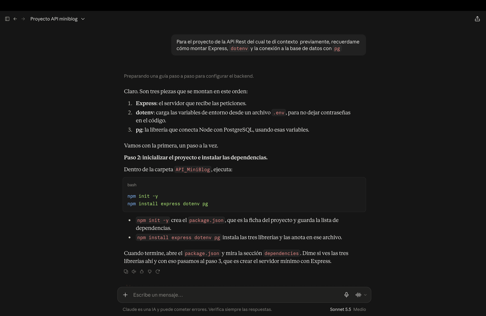
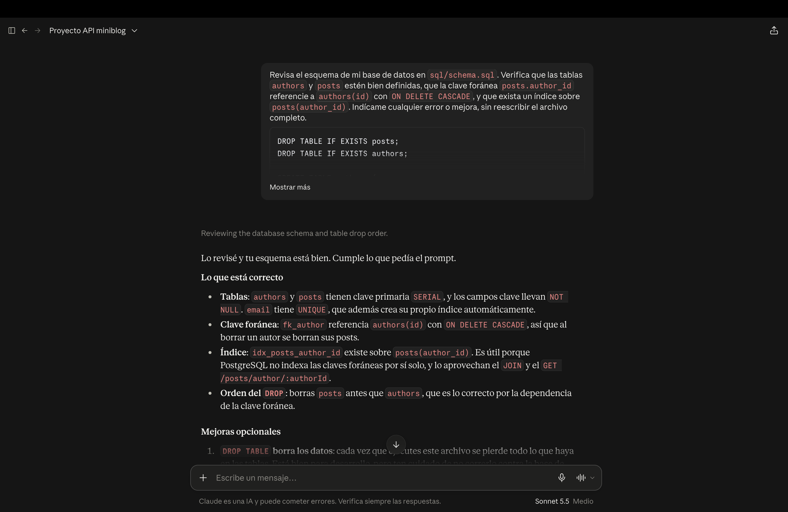
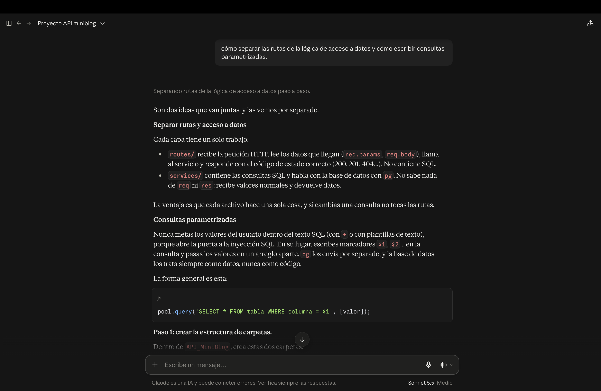
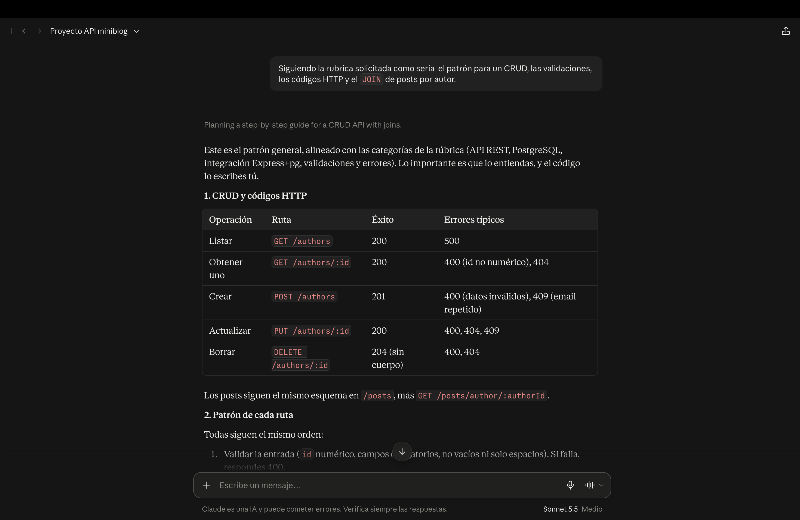
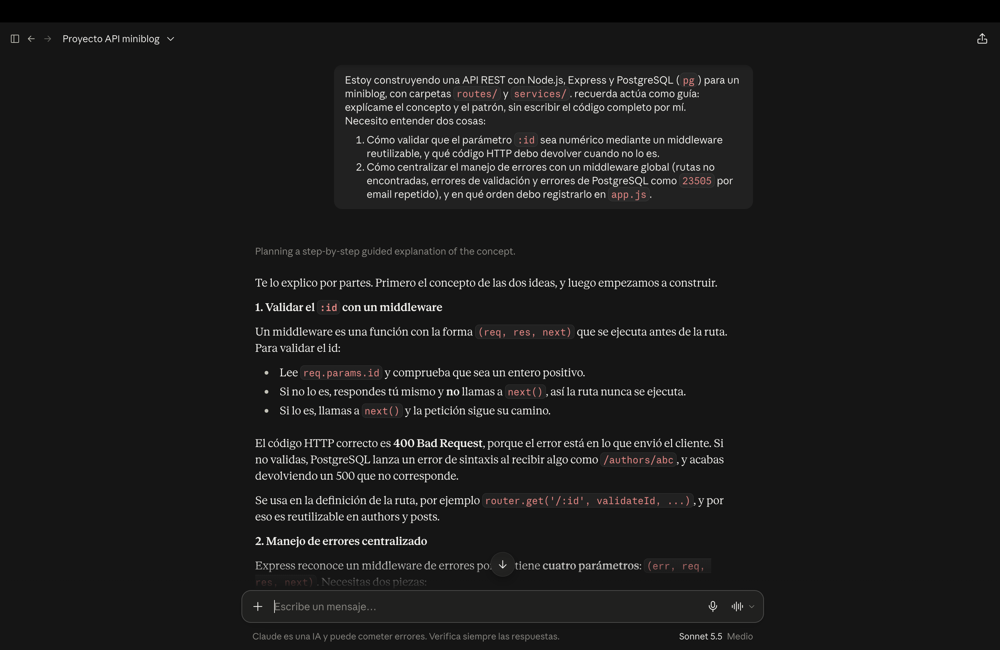
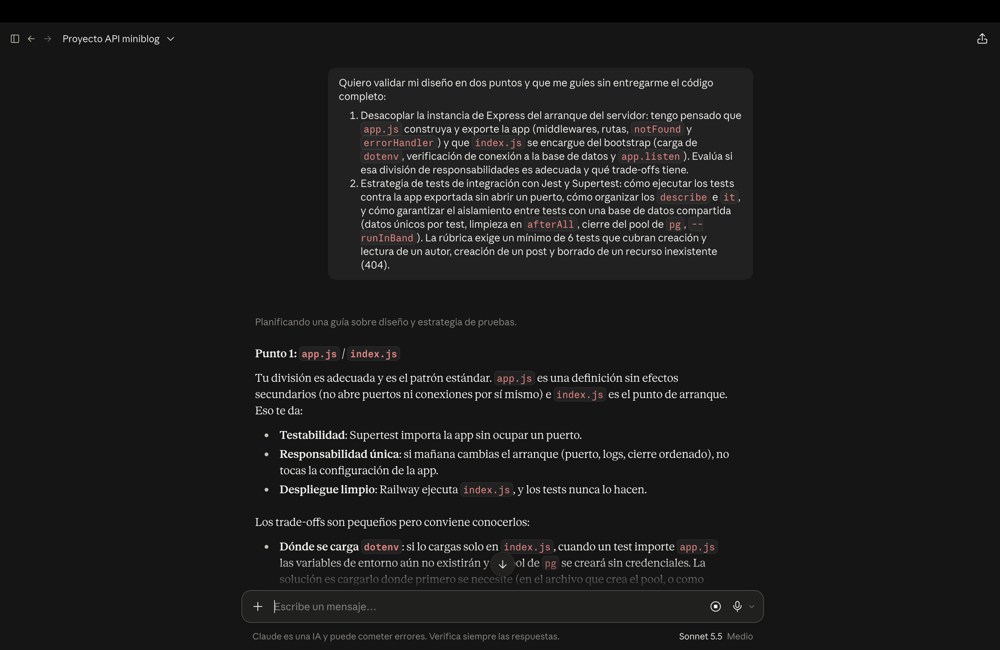

# Registro de uso de IA

Durante el Proyecto utilicé Claude (Anthropic) como apoyo. Este documento resume cómo lo usé, etapa por etapa.

---

## Cómo trabajé con la IA

Le pedí que actuara como guía durante el proyecto. Todo lo que propuso lo verifiqué y lo probé antes de incorporarlo.

---

## Primera conversación: construcción del proyecto

### 1. Estructura del servidor

**Qué pedí (resumen):** cómo montar Express, `dotenv` y la conexión a la base de datos con `pg`.

**Captura del prompt:**

**Cómo influyó:** quedó armado el servidor y su conexión a PostgreSQL.

### 2. Diseño del esquema SQL

**Qué pedí (resumen):** que revisara las tablas `authors` y `posts`, la clave foránea, `ON DELETE CASCADE` y el índice.

**Captura del prompt:**

**Cómo influyó:** salieron `schema.sql` funcional y `seed.sql` para validaciones.

### 3. Arquitectura

**Qué pedí (resumen):** cómo separar las rutas de la lógica de acceso a datos y cómo escribir consultas parametrizadas.

**Captura del prompt:**

**Cómo influyó:** el código quedó dividido en `routes` y `services`.

### 4. Endpoints

**Qué pedí (resumen):** el patrón para un CRUD, las validaciones, los códigos HTTP y el `JOIN` de posts por autor.

**Captura del prompt:**

**Cómo influyó:** implementé los 11 endpoints.

### 5. Validaciones y manejo de errores

**Qué pedí (resumen):** cómo validar ids y cómo centralizar el manejo de errores.

**Captura del prompt:**

**Cómo influyó:** nacieron el middleware `validateId` y el middleware global de errores, con respuestas 400 y 404 coherentes.

### 6. Tests

**Qué pedí (resumen):** cómo separar `app.js` de `index.js` y cómo escribir tests con Jest y Supertest.

**Captura del prompt:**

**Cómo influyó:** escribí los primeros 4 tests.

---

## Segunda conversación: revisión final contra la rúbrica

### 7. Revisión con la rúbrica y correcciones

Compartí el enunciado, la rúbrica y un resumen del proyecto para revisar qué faltaba antes de entregar.

**Prompt (textual):**

> Fianlmente te comparto un PDf el cual ontiene la rubrica, quiero que revises si todo esta bien, o si hay algo que dice en la rubrica que no se este cumpliendo para poder corregirlo y demas.

**Cómo influyó:** detecté que la rúbrica exigía al menos 6 tests con casos de error y yo tenía 4; que la ruta de posts por autor estaba mal escrita en el `openapi.yaml`; y que faltaba el README completo.
